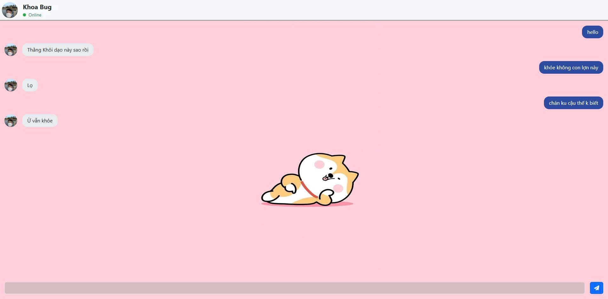

# 💬 MiniChat - Blazor Server App

Một ứng dụng nhắn tin thời gian thực (Real-time Chat Interface) đơn giản nhưng đầy đủ tính năng, được xây dựng bằng **ASP.NET Core Blazor Server**. Dự án mô phỏng cuộc trò chuyện với một Bot tự động (Khoa Bug) với các tương tác mượt mà như người thật.


*(Bạn nhớ chụp ảnh màn hình web của bạn và thay link ảnh vào đây nhé)*

## 🚀 Tính năng nổi bật (Key Features)

Dự án tập trung vào trải nghiệm người dùng (UX) với các kỹ thuật xử lý bất đồng bộ (Async/Await) và JavaScript Interop:

* **🤖 Bot Simulation:**
    * Tự động trả lời ngẫu nhiên từ kho dữ liệu.
    * **Typing Indicator:** Hiệu ứng "3 chấm nhấp nháy" mô phỏng Bot đang soạn tin nhắn.
    * **Random Delay:** Giả lập độ trễ phản hồi tự nhiên (1-2s).
* **✨ Giao diện thông minh (Smart UI):**
    * **Auto-resize Input:** Ô nhập liệu tự động giãn nở chiều cao theo nội dung (giống Facebook Messenger).
    * **Auto-scroll:** Tự động cuộn xuống tin nhắn mới nhất ngay khi gửi hoặc nhận.
    * **Online Status:** Hiệu ứng "Pulse Animation" (nhấp nháy xanh) thể hiện trạng thái hoạt động.
* **⌨️ Xử lý bàn phím:**
    * `Enter`: Gửi tin nhắn và tự động reset ô nhập liệu.
    * `Shift + Enter`: Xuống dòng.
* **🎨 Giao diện:** Thiết kế hiện đại với Bootstrap 5, Responsive 100%.

## 🛠️ Công nghệ sử dụng (Tech Stack)

* **Framework:** ASP.NET Core Blazor Server (.NET 6/7/8).
* **Ngôn ngữ:** C#, HTML5, CSS3, JavaScript.
* **UI Library:** Bootstrap 5, Font Awesome (Icons).
* **Kỹ thuật chính:**
    * JS Interop (`IJSRuntime`) để xử lý DOM events.
    * Async/Await & `Task.Delay` xử lý luồng tin nhắn.
    * CSS Animations (`@keyframes`) cho hiệu ứng chuyển động.

## 📂 Cấu trúc dự án

```text
MiniChat/
├── Pages/
│   ├── Index.razor       # Giao diện chính và Logic C# (Message handling)
│   └── _Host.cshtml      # Layout gốc, import CSS/JS library
├── wwwroot/
│   ├── css/
│   │   └── site.css      # Custom CSS (Animation, Chat bubble style)
│   └── chat.js           # JavaScript Helper (Scroll, Resize Textarea)
├── Program.cs            # Cấu hình Middleware (StaticFiles, BlazorHub)
└── README.md             # Tài liệu dự án